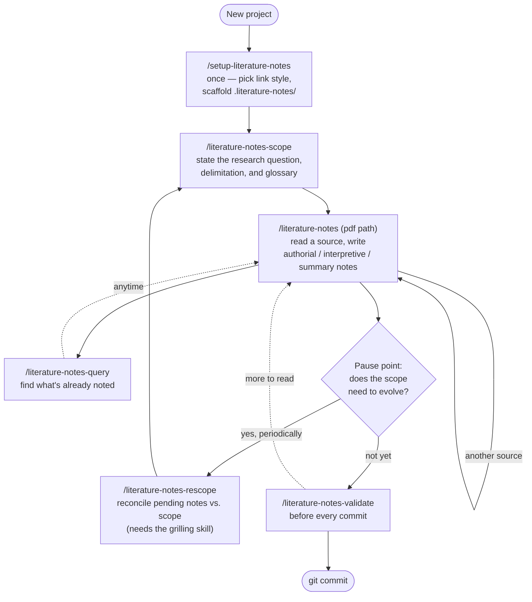
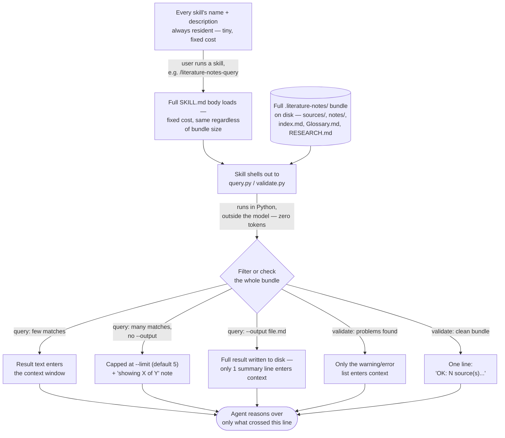

# literature-notes

**Read in:** English | [Português (Brasil)](README.pt-BR.md)

Agent skills that turn academic sources — articles, dissertations, theses,
books — into an Open Knowledge Format (OKF)-style LLM wiki of reading notes
("reading-notes"). Each note is one concept: an
authorial note (the researcher's own thinking), an interpretive note (a
reading of what the author meant), or a summary note (a neutral account of
what the author argued) — always anchored to a page and, when relevant,
wikilinked into a shared research glossary.

The bundle this system builds and maintains lives at `.literature-notes/` in
your project — separate from any general-purpose knowledge base — and is
meant for the specific discipline of academic research: citations, page
references, a controlled tag vocabulary, and a research scope the notes stay
accountable to.

## Install

```bash
npx skills add emvalencaf/literature-notes
```

This installs every skill in this repository. To install a single skill:

```bash
npx skills add emvalencaf/literature-notes/skills/literature-notes
```

**Dependency**: `literature-notes-rescope` invokes the `grilling` skill to
run its interview. Install it too:

```bash
npx skills@latest add mattpocock/skills --skill grilling
```

Without it, `/literature-notes-rescope` won't work.

## Skills

| Skill | Use it to |
| --- | --- |
| [`literature-notes-ask-how`](skills/literature-notes-ask-how) | Not sure which skill fits what you're doing — ask. A router over the other skills; explicit-invoke only. |
| [`setup-literature-notes`](skills/setup-literature-notes) | One-time, idempotent setup: scaffolds `.literature-notes/`, asks your link style (Obsidian vs. plain Markdown), and documents the workflow in `CLAUDE.md`/`AGENTS.md`. Run this first. |
| [`literature-notes`](skills/literature-notes) | Extract a PDF (or a page range), then write one note per annotation — authorial, interpretive, or summary — with ABNT citation metadata and page references. |
| [`literature-notes-scope`](skills/literature-notes-scope) | Build and sharpen `RESEARCH.md` (the research question, objectives, delimitation) and `Glossary.md` (the controlled glossary of concepts). |
| [`literature-notes-rescope`](skills/literature-notes-rescope) | Interview yourself, one work at a time, about notes that haven't been confronted with the current research scope yet, and update the scope/glossary as understanding is reached. Takes an optional source id or note path to target one directly, instead of picking from the pending backlog. Requires the `grilling` skill (see Install). |
| [`literature-notes-query`](skills/literature-notes-query) | Search the note bundle by tag, source, note kind, page, influence links, verification status, or free text. |
| [`literature-notes-validate`](skills/literature-notes-validate) | Check the bundle for broken references: unknown tags, dangling `influences` links, undefined `Glossary.md` terms, orphaned decision records, missing `type` metadata. |

Not sure which one you need right now? Run `/literature-notes-ask-how`.

## How to use

Most sessions run one cycle: set up once, state a scope, then loop
read → query as you work through sources, pausing periodically to
reconcile notes against the scope before you validate and commit.



Not sure where you are in that cycle? Run `/literature-notes-ask-how`.

### Step by step

1. **`/setup-literature-notes`** — once per project. Scaffolds
   `.literature-notes/`, asks whether cross-references should be Obsidian
   `[[wikilink]]`s or plain Markdown links, and documents the workflow in
   `CLAUDE.md`/`AGENTS.md`.
2. **`/literature-notes-scope`** — state the research question, what's
   explicitly out of scope, and any term worth pinning down in the glossary.
   Come back here whenever the scope itself needs to move, not just at the
   start.
3. **`/literature-notes <pdf-path>`** — read a source (or a page range),
   filtered through that scope. Repeat for every source; this is the step
   you'll run most often.
4. **`/literature-notes-query`** — search what's already noted, by tag,
   source, kind, page, or free text. Run this constantly, not only when
   drafting.
5. **`/literature-notes-rescope`** — periodically (batch it, don't run it
   after every single note), confront notes nobody's reconciled with the
   current scope yet, and let `RESEARCH.md`/`Glossary.md` evolve where the
   evidence pushes them to. With no argument it picks from the pending
   backlog (asking which source if more than one has pending notes); pass a
   source id (`/literature-notes-rescope dworkin-1986`) or a note path to
   target one directly instead.
6. **`/literature-notes-validate`** — before every commit, catch broken
   references.

### Worked example

A researcher studying judicial activism at Brazil's Supreme Court (STF):

```bash
# 1. One-time setup
/setup-literature-notes --link-style obsidian

# 2. State the scope (a conversation, not a flag)
/literature-notes-scope
# > "My research question is about the limits of judicial activism at the
# >  STF between 2015 and 2023. I want to pin down what 'judicial activism'
# >  means for this dissertation, since authors disagree."

# 3. Read a source against that scope
/literature-notes ~/papers/dworkin-1986-taking-rights-seriously.pdf \
  --pages 45-60 --focus "how judicial discretion is theorized"

# 4. Find what you've noted so far
/literature-notes-query --note-kind interpretive --tag regra-vs-principio

# 5. Periodically, reconcile notes against the scope
/literature-notes-rescope

# 6. Before committing .literature-notes/ changes
/literature-notes-validate
```

Step 3 produces a source record and, say, one interpretive note:

```
.literature-notes/
├── config.md              # link_style: obsidian
├── tags.md
├── index.md
├── RESEARCH.md
├── Glossary.md
├── sources/
│   └── dworkin-1986.md
├── notes/
│   └── dworkin-1986--p52--regra-vs-principio.md
└── decisions/
```

`notes/dworkin-1986--p52--regra-vs-principio.md`:

```yaml
---
type: "Reading Note"
source_id: "[[dworkin-1986]]"
page: 52
note_kind: interpretive
tags: [regra-vs-principio]
influences: []
abnt_citation: "(DWORKIN, 1986, p. 52)"
generated:
  by: "literature-notes/claude-sonnet-5"
  at: "2026-09-17T14:32:00Z"
---

> "Rules are applicable in an all-or-nothing fashion. If the facts a rule
> stipulates are given, then either the rule is valid, in which case the
> answer it supplies must be accepted, or it is not."

Dworkin's rule/principle distinction is what makes room for
[[Glossary#Judicial Activism]] in the first place: a rule alone can't decide
a case where competing principles are in play, and it's exactly that gap
courts fill when weighing principles against each other.
```

The quote stays in its original language (here, English, since that's the
source's language); the note's own prose follows whatever language the
researcher is writing to the agent in — Portuguese in this example's real
use case, English above only because this README is in English.

## Design notes

- **It's a wiki, not a pile of files.** Link liberally — especially when
  citing. Whenever a note, `RESEARCH.md`, or `Glossary.md` mentions a source
  already in `sources/`, a defined `Glossary.md` term, another existing
  note, or a decision record, that mention is a link, not bare prose. Only a
  thing's first-ever mention (nothing to link to yet) stays unlinked.
- **One note, one concept.** Notes are small and composable rather than long
  summaries per source, so they can be queried, tagged, and cross-linked
  independently of the work they came from.
- **Scope-accountable.** Every note is taken against a stated research focus
  (`RESEARCH.md`), not as a neutral summary of the source — and
  `literature-notes-rescope` makes sure notes and scope stay in sync as your
  understanding develops, instead of drifting apart silently.
- **Deterministic checks, not vibes.** `literature-notes-query` and
  `literature-notes-validate` are plain scripts operating on the bundle's
  frontmatter — reproducible results, not another LLM pass.

## Link style

`.literature-notes/config.md` picks how every cross-reference above is
written, chosen once during `/setup-literature-notes`:

- **`obsidian`** (default) — `[[wikilink]]` syntax throughout: `source_id:
  "[[dworkin-1986]]"`, inline `[[Glossary#Judicial Activism]]`. Best if you
  read/edit the bundle in Obsidian or another wikilink-aware tool.
- **`markdown`** — plain relative links instead: `source_id: "dworkin-1986"`,
  inline `[Judicial Activism](./Glossary.md#judicial-activism)`. Best for
  GitHub/GitLab, a static-site generator, or any viewer that doesn't
  understand `[[wikilinks]]`.

Every content-writing skill reads this file first. `literature-notes-query`
and `literature-notes-validate` work the same either way — the query's
`--text`/frontmatter filters and the validator's reference checks recognize
both syntaxes.

## Metadata

Every concept file's frontmatter loosely follows the
[Open Knowledge Format](https://github.com/GoogleCloudPlatform/knowledge-catalog/blob/main/okf/SPEC.md)
(OKF) — "loosely" because `.literature-notes/` is OKF-*inspired*, not a
conformant OKF bundle (it never declares `okf_version`, and `index.md` keeps
its own bespoke shape rather than OKF's reserved listing format).

- **`type`** — every note (`Reading Note`), source (`Reference`), decision
  (`Decision`), `RESEARCH.md` (`Research Scope`), and `Glossary.md`
  (`Glossary`) carries one, per OKF's one-required-field convention.
- **`generated: {by, at}`** — who/what produced the current content and when.
  `by` follows OKF's actor convention: `<skill>/<model-id>` for
  agent-authored content, `human:<id>` for a person.
- **`verified: {by, at}`** — set once a human confirms a note is fine *as
  written*, with no changes. Nothing sets this automatically; work through
  the backlog with `/literature-notes-query --verified false`.
- **`reviewed: {by, at, assisted_by?}`** — set when a human updates or adds
  to a note, `RESEARCH.md`, or `Glossary.md`, optionally noting which
  agent/model assisted (`assisted_by`); omitted for an unassisted manual
  edit. Distinct from `verified`: this is "content changed," not "content
  confirmed unchanged."
- **`status`** (`draft | stable | deprecated`) — only on authorial notes and
  `RESEARCH.md`, since those represent the researcher's own evolving
  thinking. Always human-set; no skill transitions it on its own.
- This is **separate** from `review_status`/`scope_reviewed_at` (tracked in
  `index.md`), which is about whether a note has been confronted with the
  current research scope — a different axis, owned by
  `literature-notes-rescope`.

## Search internals & token cost

How much a query/validation pass costs you is a common question, so here's
the actual mechanism rather than a rule of thumb.



The disk side (bottom of the diagram) can hold hundreds of notes at zero
token cost — nothing there is ever "in context" until the filter/check step
decides it's relevant, and even then only the decided-relevant *text*
crosses into the context window, never the bundle wholesale.

**Skill loading is two-tier.** Only a skill's `name` + `description` stay
resident in context, all the time, for every skill in the pack — that's what
decides whether it gets invoked. The full `SKILL.md` body, its `scripts/`,
and its `assets/`/`references/` only load when the skill is actually called.
This cost is fixed per invocation; it doesn't grow with how big your
`.literature-notes/` bundle is.

**`/literature-notes-query` never loads the bundle into the model.** It
shells out to `query.py`, a plain Python script that runs *outside* the
LLM: it globs `sources/*.md`/`notes/*.md`, parses YAML frontmatter, filters,
and only the matched documents' text is what comes back to the chat. A
100-note bundle and a 3-note bundle cost the same to query, as long as the
same number of results match.

- Structural filters (`--tag`, `--source-id`, `--note-kind`, `--page`,
  `--influences`, `--verified`) are frontmatter equality checks — cheap and
  precise. `--text` is a case-insensitive substring scan across the whole
  body **and** metadata of every candidate document; it still costs nothing
  extra in tokens (the scan happens in the script), but it's a blunter
  filter, so it tends to return more matches than a structural one would.
- `--limit` (default **5** to stdout, unlimited with `--output`) caps what
  actually enters the chat. Five matches at a few hundred words each is a
  few hundred to ~1k tokens; asking for 50 is the same computation, ten
  times the tokens returned.
- `--output <file.md>` writes the full result set to disk and prints one
  summary line (`Wrote N of M result(s) to <file>`) — use it to compile
  something you (or a later step) will read from disk, not when you need
  the results in front of you right now.

**`/literature-notes-validate` returns a report, never bundle content.**
`validate.py` walks every file's frontmatter and body, but what comes back
to the chat is only the warning/error list — or, if the bundle is clean, one
line: `OK: N source(s), M note(s), K decision(s), no broken references.`
Cost scales with **problems found**, not with how many files existed to
check.

**`index.md` is the cheap orientation layer.** One row per note (id, source,
`review_status`) — reading the whole table costs a fraction of opening every
note's body. With no argument, `/literature-notes-rescope`'s Step 0 reads
`index.md` first specifically so it only opens the notes in the cluster it's
about to interview you on, never the whole `notes/` directory. Passing it a
**source id or note path directly** skips even that: it goes straight to
that source's/note's own rows instead of filtering `index.md` for every
pending row across the whole bundle — the cheapest way to invoke it when you
already know what you want reviewed.

| Operation | What enters the chat | Scales with |
| --- | --- | --- |
| `/literature-notes-query` (stdout, default) | up to 5 matched docs, full text | number of *matches*, capped at 5 |
| `/literature-notes-query --output f.md` | one summary line | nothing — the rest is on disk |
| `/literature-notes-validate` | the warning/error list, or one "OK" line | number of *problems*, not bundle size |
| Reading `index.md` | one line per note | number of notes (no bodies) |
| `/literature-notes-rescope` (no argument) | `index.md` + the chosen cluster's notes | pending notes across the bundle, then just that cluster |
| `/literature-notes-rescope <source-id\|note-path>` | that source's/note's rows + notes only | the *targeted* note(s) alone |

The net effect: the bundle can grow to hundreds of notes without a single
query or validation pass getting more expensive — only what actually
matches, or what's actually broken, ever reaches the model.

## License

[MIT](LICENSE)
