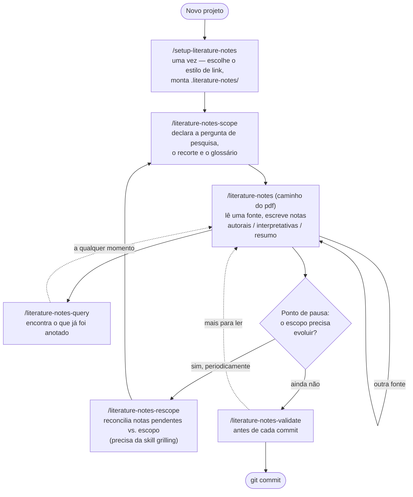
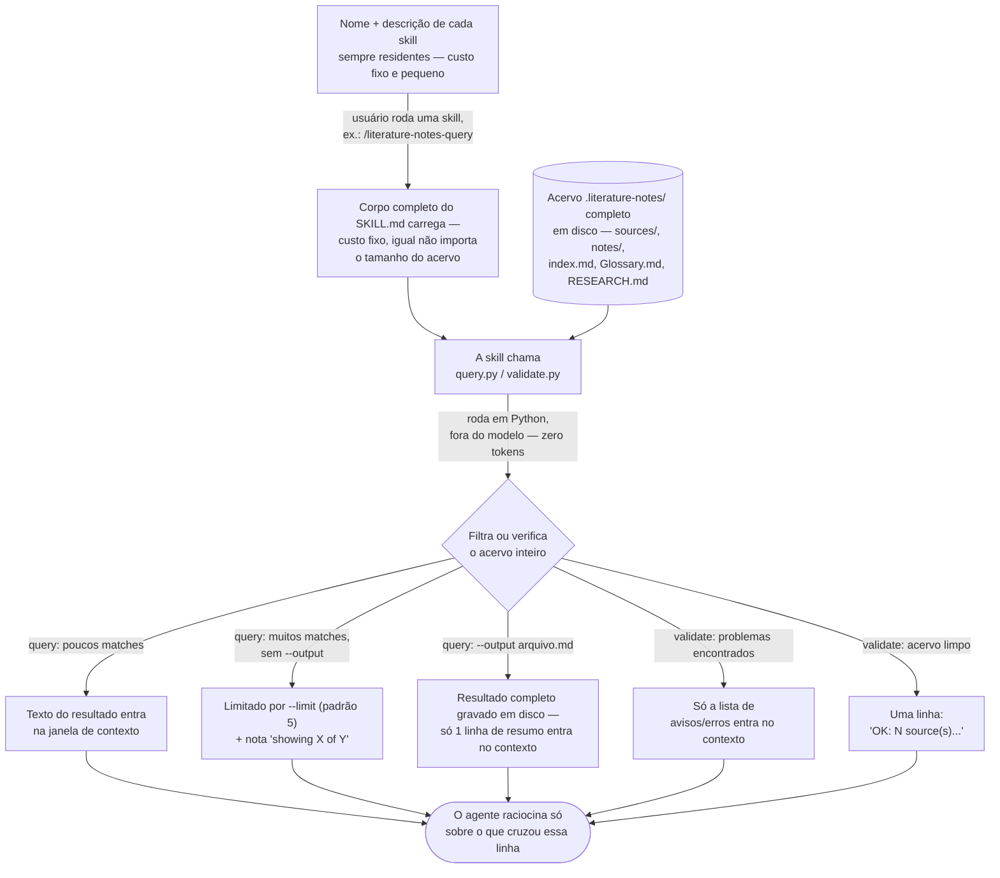

# literature-notes

**Leia em:** [English](README.md) | Português (Brasil)

Skills de agente que transformam fontes acadêmicas — artigos, dissertações,
teses, livros — em uma wiki de fichamento no estilo Open Knowledge Format
(OKF) ("reading-notes"). Cada nota é um conceito: uma nota autoral (a ideia
do próprio pesquisador), uma nota interpretativa (uma leitura do que o autor
quis dizer) ou uma nota resumo (um relato neutro do que o autor argumentou)
— sempre ancorada a uma página e, quando relevante, linkada a um glossário
de pesquisa compartilhado.

O acervo que este sistema constrói e mantém vive em `.literature-notes/` no
seu projeto — separado de qualquer base de conhecimento genérica — e é
voltado à disciplina específica da pesquisa acadêmica: citações, referências
de página, um vocabulário controlado de tags e um escopo de pesquisa ao qual
as notas ficam sempre prestando contas.

## Instalação

```bash
npx skills add emvalencaf/literature-notes
```

Isso instala todas as skills deste repositório. Para instalar uma única
skill:

```bash
npx skills add emvalencaf/literature-notes/skills/literature-notes
```

**Dependência**: `literature-notes-rescope` invoca a skill `grilling` para
rodar sua entrevista. Instale também:

```bash
npx skills@latest add mattpocock/skills --skill grilling
```

Sem ela, `/literature-notes-rescope` não funciona.

## Skills

| Skill | Serve para |
| --- | --- |
| [`literature-notes-ask-how`](skills/literature-notes-ask-how) | Não sabe qual skill usar? Pergunte. Um roteador sobre as outras skills; só invocação explícita. |
| [`setup-literature-notes`](skills/setup-literature-notes) | Setup único e idempotente: monta `.literature-notes/`, pergunta seu estilo de link (Obsidian vs. Markdown puro), e documenta o fluxo em `CLAUDE.md`/`AGENTS.md`. Rode isso primeiro. |
| [`literature-notes`](skills/literature-notes) | Extrai um PDF (ou um intervalo de páginas), então escreve uma nota por anotação — autoral, interpretativa ou resumo — com metadados de citação ABNT e referências de página. |
| [`literature-notes-scope`](skills/literature-notes-scope) | Constrói e afina o `RESEARCH.md` (a pergunta de pesquisa, objetivos, recorte) e o `Glossary.md` (o glossário controlado de conceitos). |
| [`literature-notes-rescope`](skills/literature-notes-rescope) | Entrevista você, um trabalho por vez, sobre notas que ainda não foram confrontadas com o escopo atual da pesquisa, e atualiza o escopo/glossário conforme o entendimento avança. Aceita opcionalmente um source id ou path de nota para mirar em uma diretamente, em vez de escolher a partir do backlog pendente. Requer a skill `grilling` (veja Instalação). |
| [`literature-notes-query`](skills/literature-notes-query) | Busca no acervo de notas por tag, source, tipo de nota, página, links de influência, status de verificação ou texto livre. |
| [`literature-notes-validate`](skills/literature-notes-validate) | Verifica o acervo por referências quebradas: tags fora do vocabulário, links `influences` pendurados, termos indefinidos no `Glossary.md`, registros de decisão órfãos, metadado `type` ausente. |

Não sabe qual delas você precisa agora? Rode `/literature-notes-ask-how`.

## Como usar

A maioria das sessões roda um único ciclo: configurar uma vez, declarar um
escopo, depois alternar entre ler e consultar conforme você avança pelas
fontes, pausando periodicamente para reconciliar as notas com o escopo antes
de validar e commitar.



Não sabe em que ponto do ciclo você está? Rode `/literature-notes-ask-how`.

### Passo a passo

1. **`/setup-literature-notes`** — uma vez por projeto. Monta
   `.literature-notes/`, pergunta se as referências cruzadas devem ser
   `[[wikilink]]`s no estilo Obsidian ou links Markdown comuns, e documenta
   o fluxo em `CLAUDE.md`/`AGENTS.md`.
2. **`/literature-notes-scope`** — declare a pergunta de pesquisa, o que
   está explicitamente fora do escopo, e qualquer termo que valha a pena
   fixar no glossário. Volte aqui sempre que o escopo em si precisar mudar,
   não só no início.
3. **`/literature-notes <caminho-do-pdf>`** — leia uma fonte (ou um
   intervalo de páginas), filtrada por esse escopo. Repita para cada fonte;
   esse é o passo que você vai rodar com mais frequência.
4. **`/literature-notes-query`** — busque o que já foi anotado, por tag,
   source, tipo, página ou texto livre. Use isso o tempo todo, não só na
   hora de redigir.
5. **`/literature-notes-rescope`** — periodicamente (agrupe várias notas,
   não rode isso depois de cada nota individual), confronte as notas que
   ninguém ainda reconciliou com o escopo atual, e deixe `RESEARCH.md`/
   `Glossary.md` evoluírem onde a evidência realmente empurra isso. Sem
   argumento, ele escolhe a partir do backlog pendente (perguntando qual
   source, se mais de uma tiver notas pendentes); passe um source id
   (`/literature-notes-rescope dworkin-1986`) ou um path de nota para mirar
   em uma diretamente.
6. **`/literature-notes-validate`** — antes de cada commit, para pegar
   referências quebradas.

### Exemplo prático

Um pesquisador estudando ativismo judicial no Supremo Tribunal Federal
(STF):

```bash
# 1. Setup único
/setup-literature-notes --link-style obsidian

# 2. Declara o escopo (uma conversa, não uma flag)
/literature-notes-scope
# > "Minha pergunta de pesquisa é sobre os limites do ativismo judicial no
# >  STF entre 2015 e 2023. Quero fixar o que 'ativismo judicial' significa
# >  para esta dissertação, já que os autores discordam."

# 3. Lê uma fonte contra esse escopo
/literature-notes ~/papers/dworkin-1986-taking-rights-seriously.pdf \
  --pages 45-60 --focus "como a discricionariedade judicial é teorizada"

# 4. Encontra o que já foi anotado
/literature-notes-query --note-kind interpretive --tag regra-vs-principio

# 5. Periodicamente, reconcilia as notas com o escopo
/literature-notes-rescope

# 6. Antes de commitar mudanças em .literature-notes/
/literature-notes-validate
```

O passo 3 produz um registro de source e, digamos, uma nota interpretativa:

```
.literature-notes/
├── config.md              # link_style: obsidian
├── tags.md
├── index.md
├── RESEARCH.md
├── Glossary.md
├── sources/
│   └── dworkin-1986.md
├── notes/
│   └── dworkin-1986--p52--regra-vs-principio.md
└── decisions/
```

`notes/dworkin-1986--p52--regra-vs-principio.md`:

```yaml
---
type: "Reading Note"
source_id: "[[dworkin-1986]]"
page: 52
note_kind: interpretive
tags: [regra-vs-principio]
influences: []
abnt_citation: "(DWORKIN, 1986, p. 52)"
generated:
  by: "literature-notes/claude-sonnet-5"
  at: "2026-09-17T14:32:00Z"
---

> "Rules are applicable in an all-or-nothing fashion. If the facts a rule
> stipulates are given, then either the rule is valid, in which case the
> answer it supplies must be accepted, or it is not."

A distinção entre regra e princípio feita por Dworkin é exatamente o que
abre espaço para o [[Glossary#Judicial Activism]] existir: uma regra sozinha
não consegue decidir um caso em que princípios concorrentes estão em jogo, e
é exatamente essa lacuna que os tribunais preenchem ao ponderar princípios
entre si.
```

A citação permanece no idioma original da fonte (aqui, inglês, já que foi
nessa língua que Dworkin escreveu); a prosa da própria nota segue o idioma
em que o pesquisador escreve para o agente — português, neste exemplo, por
ser essa a situação real que ele descreve. O termo `Judicial Activism` no
glossário fica no idioma original em que foi cunhado (veja "Notas de
design" abaixo) — mesmo com a nota em português ao redor dele.

Um bundle completo e autoconsistente que leva esse mesmo cenário adiante —
uma segunda fonte, uma entrevista de `/literature-notes-rescope` e o
decision record resultante — está em
[`examples/dworkin-stf-judicial-activism`](examples/dworkin-stf-judicial-activism)
para você ler do início ao fim ou rodar os scripts diretamente contra ele.

## Notas de design

- **É uma wiki, não uma pilha de arquivos.** Linke liberalmente —
  especialmente ao citar. Sempre que uma nota, `RESEARCH.md` ou
  `Glossary.md` mencionar um source já em `sources/`, um termo definido em
  `Glossary.md`, outra nota já existente, ou um registro de decisão, essa
  menção é um link, não prosa solta. Só a primeira menção de algo que ainda
  não existe fica sem link.
- **Uma nota, um conceito.** Notas são pequenas e componíveis em vez de
  resumos longos por source, para que possam ser consultadas, taggeadas e
  linkadas entre si independentemente do trabalho de onde vieram.
- **Prestando contas ao escopo.** Toda nota é tomada contra um foco de
  pesquisa declarado (`RESEARCH.md`), não como um resumo neutro do source —
  e `literature-notes-rescope` garante que notas e escopo permaneçam
  sincronizados conforme seu entendimento evolui, em vez de se distanciarem
  silenciosamente.
- **Checagens determinísticas, não achismo.** `literature-notes-query` e
  `literature-notes-validate` são scripts simples que operam sobre o
  frontmatter do acervo — resultados reproduzíveis, não mais uma passada de
  LLM.

## Estilo de link

`.literature-notes/config.md` escolhe como cada referência cruzada acima é
escrita, definido uma vez durante o `/setup-literature-notes`:

- **`obsidian`** (padrão) — sintaxe `[[wikilink]]` em tudo: `source_id:
  "[[dworkin-1986]]"`, `[[Glossary#Judicial Activism]]` inline. Melhor se
  você ler/editar o acervo no Obsidian ou outra ferramenta que entenda
  wikilinks.
- **`markdown`** — links relativos comuns no lugar: `source_id:
  "dworkin-1986"`, `[Judicial Activism](./Glossary.md#judicial-activism)`
  inline. Melhor para GitHub/GitLab, um gerador de site estático, ou
  qualquer visualizador que não entenda `[[wikilinks]]`.

Toda skill que escreve conteúdo lê esse arquivo primeiro.
`literature-notes-query` e `literature-notes-validate` funcionam igual nos
dois casos — os filtros `--text`/frontmatter da consulta e as checagens de
referência do validador reconhecem as duas sintaxes.

## Metadados

O frontmatter de todo concept file segue livremente o Open Knowledge Format
([OKF](https://github.com/GoogleCloudPlatform/knowledge-catalog/blob/main/okf/SPEC.md))
— "livremente" porque `.literature-notes/` é *inspirado* no OKF, não um
acervo conformante (nunca declara `okf_version`, e `index.md` mantém sua
própria forma em vez do formato de listagem reservado do OKF).

- **`type`** — toda nota (`Reading Note`), source (`Reference`), decisão
  (`Decision`), `RESEARCH.md` (`Research Scope`) e `Glossary.md`
  (`Glossary`) carrega um, seguindo a convenção do OKF de único campo
  obrigatório.
- **`generated: {by, at}`** — quem/o que produziu o conteúdo atual e quando.
  `by` segue a convenção de ator do OKF: `<skill>/<model-id>` para conteúdo
  gerado por agente, `human:<id>` para uma pessoa.
- **`verified: {by, at}`** — definido quando um humano confirma que uma nota
  está boa *como está escrita*, sem mudanças. Nada define isso
  automaticamente; trabalhe o backlog com
  `/literature-notes-query --verified false`.
- **`reviewed: {by, at, assisted_by?}`** — definido quando um humano
  atualiza ou adiciona algo a uma nota, `RESEARCH.md` ou `Glossary.md`,
  opcionalmente anotando qual agente/modelo assistiu (`assisted_by`);
  omitido numa edição manual sem assistência. Diferente de `verified`: isso
  é "conteúdo mudou", não "conteúdo confirmado sem mudança".
- **`status`** (`draft | stable | deprecated`) — só em notas autorais e em
  `RESEARCH.md`, já que representam o pensamento em evolução do próprio
  pesquisador. Sempre definido por humano; nenhuma skill transiciona isso
  sozinha.
- Isso é **separado** de `review_status`/`scope_reviewed_at` (rastreado em
  `index.md`), que é sobre se uma nota já foi confrontada com o escopo de
  pesquisa atual — um eixo diferente, de responsabilidade do
  `literature-notes-rescope`.

## Internals da busca & custo de tokens

Quanto custa uma consulta ou validação é uma pergunta comum, então aqui vai
o mecanismo real em vez de uma regra de bolso.



O lado do disco (embaixo no diagrama) pode guardar centenas de notas a
custo zero de tokens — nada ali está "no contexto" até o passo de
filtragem/checagem decidir que é relevante, e mesmo assim só o *texto*
decidido relevante cruza para a janela de contexto, nunca o acervo por
inteiro.

**O carregamento de skill é em duas camadas.** Só o `name` + `description`
de uma skill ficam residentes no contexto, o tempo todo, para toda skill do
pacote — é isso que decide se ela é invocada. O corpo completo do
`SKILL.md`, seus `scripts/`, e seus `assets/`/`references/` só carregam
quando a skill é de fato chamada. Esse custo é fixo por invocação; não
cresce com o tamanho do seu acervo `.literature-notes/`.

**`/literature-notes-query` nunca carrega o acervo inteiro no modelo.** Ele
chama `query.py`, um script Python simples que roda *fora* do LLM: ele
percorre `sources/*.md`/`notes/*.md`, interpreta o frontmatter YAML, filtra,
e só o texto dos documentos que bateram é o que volta pro chat. Um acervo
com 100 notas e um com 3 notas custam o mesmo para consultar, desde que o
mesmo número de resultados bata.

- Filtros estruturais (`--tag`, `--source-id`, `--note-kind`, `--page`,
  `--influences`, `--verified`) são checagens de igualdade no frontmatter —
  baratas e precisas. `--text` é uma busca por substring, sem diferenciar
  maiúsculas/minúsculas, em todo o corpo **e** metadados de cada documento
  candidato; ainda assim não custa tokens extras (a busca acontece no
  script), mas é um filtro mais grosseiro, então tende a retornar mais
  resultados do que um estrutural.
- `--limit` (padrão **5** no stdout, ilimitado com `--output`) limita o que
  realmente entra no chat. Cinco resultados de algumas centenas de palavras
  cada é algo entre algumas centenas e ~1 mil tokens; pedir 50 é o mesmo
  processamento, dez vezes mais tokens retornados.
- `--output <arquivo.md>` grava o conjunto completo de resultados em disco e
  imprime uma linha de resumo (`Wrote N of M result(s) to <arquivo>`) — use
  isso para compilar algo que você (ou um passo posterior) vai ler do disco,
  não quando você precisa ver os resultados na hora.

**`/literature-notes-validate` retorna um relatório, nunca o conteúdo do
acervo.** `validate.py` percorre o frontmatter e o corpo de todo arquivo,
mas o que volta pro chat é só a lista de avisos/erros — ou, se o acervo
estiver limpo, uma linha: `OK: N source(s), M note(s), K decision(s), no
broken references.` O custo escala com **problemas encontrados**, não com
quantos arquivos existiam para checar.

**`index.md` é a camada barata de orientação.** Uma linha por nota (id,
source, `review_status`) — ler a tabela inteira custa uma fração de abrir
o corpo de cada nota. Sem argumento, o Passo 0 do
`/literature-notes-rescope` lê o `index.md` primeiro exatamente para só
abrir as notas do cluster que está prestes a entrevistar você sobre, nunca
a pasta `notes/` inteira. Passar um **source id ou path de nota
diretamente** pula até isso: ele vai direto às linhas daquele source/nota,
em vez de filtrar o `index.md` inteiro atrás de cada linha pendente no
acervo — a forma mais barata de invocá-lo quando você já sabe o que quer
revisar.

| Operação | O que entra no chat | Escala com |
| --- | --- | --- |
| `/literature-notes-query` (stdout, padrão) | até 5 documentos que bateram, texto completo | número de *matches*, limitado a 5 |
| `/literature-notes-query --output f.md` | uma linha de resumo | nada — o resto fica em disco |
| `/literature-notes-validate` | a lista de avisos/erros, ou uma linha "OK" | número de *problemas*, não o tamanho do acervo |
| Ler `index.md` | uma linha por nota | número de notas (sem corpos) |
| `/literature-notes-rescope` (sem argumento) | `index.md` + as notas do cluster escolhido | notas pendentes no acervo inteiro, depois só o cluster |
| `/literature-notes-rescope <source-id\|path-da-nota>` | só as linhas e notas daquele alvo | só a(s) nota(s) *mirada(s)* |

O efeito líquido: o acervo pode crescer a centenas de notas sem que uma
única consulta ou validação fique mais cara — só o que de fato bate, ou o
que de fato está quebrado, chega até o modelo.

## Licença

[MIT](LICENSE)
