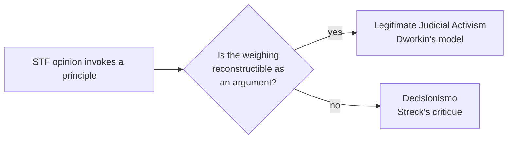

> "O problema não é o juiz decidir com base em princípios; o problema é
> chamar de 'princípio' qualquer enunciado que sirva para justificar a
> resposta que ele já havia escolhido antes de fundamentar."

Streck's target isn't [[dworkin-1986--p52--regra-vs-principio]]'s
rule/principle model itself, but a *misuse* of it: an STF opinion can cite
"principles" the way a rule-bound judge would cite a rule — as a label
stapled onto a conclusion reached beforehand, not as the output of an
actual weighing. That's a distinct failure mode from anything
[[dworkin-1986]] describes, and it's forced me to ask whether "principle
weighing" alone is a sufficient test for legitimate
[[Glossary#Judicial Activism]], or whether it also needs to be
*reconstructible* as an argument — see
[[decisions/2026-09-15--incorporate-streck-critique]] for how this reshaped
the research's theoretical framework.

